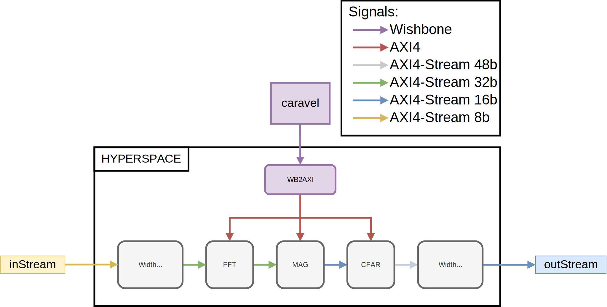

# HYPERSPACE 0.5

A HYbride ParametErizable Radar Signal Processing ACcElerator (HYPERSPACE) version 0.5.

HYPERSPACE consists of an instance produced by a digital HYPERSPACE generator designed in Chisel hardware design language. Caravel is connected to the HYPERSPACE via Wishbone to AXI4 bridge. Block diagram of the HYPERSPACE is given below.



This directory contains following HYPERSPACE directories:

* `HyperSpace` -  contains digital HYPERSPACE generator with built in test structures designed in [Chisel](http://www.chisel-lang.org) HDL.
*  `HyperSpace/generators` - DSP generators used to generate HYPERSPACE
     * [FFT](https://github.com/milovanovic/sdf-fft)
     * [Magnitude](https://github.com/milovanovic/logMagMux)
     * [CFAR](https://github.com/milovanovic/cfar)
*  `HyperSpace/Makefile` - have targets for verilog and test generation
* `verilog/dv/hyperspace` - contains verilog testbenches for HYPERSPACE integrated with Caravel
* `verilog/rtl` - contains `user_project_wrapper.v` which is the top level verilog file for HYPERSPACE

## Verilog generation
Go to folder HyperSpace
```sh
$ cd Hyperspace
```

Before running make commands, we could set the size of FFT inside HYPERSPACE. Default size is 512 with the minimum SRAM depth larger then 128. For example, we could set the size of the FFT inside HYPERSPACE to be equal to 256 with the command:
```sh
$ export SIZE=256
```
and we could replace all memories with the depth larger then 64 with SRAM wrappers with:
```sh
$ export DEPTH=64
```
There is an option to flatten generated verilog code with:
```sh
$ export FLATTEN=true
```

In order to generate HYPERSPACE verilog file (with, for example, FFT size of 512, replace memories with depth larger then 128 with SRAMs and flattened netlist), we could run:
```sh
$ make verilog_hyperspace SIZE=512 DEPTH=128 FLATTEN=true
```
To copy generated verilog to ../verilog/rtl run:
```sh
$ make copy_hyperspace
```
## Chisel tests

Inside HyperSpace directory, run:
```sh
$ make test_hyperspace
```
This command will run tests for three different configurations of CFAR. Running chisel tests will update gold models for RTL tests. 

For HYPERSPACE testing, you can only change size of the FFT.


## Linter

To run verilator linter on user_project_wrapper.v go to the HyperSpace directory and run:
```sh
$ make lint
```

## RTL and GL tests
In order to run RTL test, inside top directory run:
```sh
$ make verify-hyperspace-rtl # Test for Cell averaging (CA) CFAR
```
```sh
$ make verify-hyperspace_random-rtl # Test for Cell averaging (CA) CFAR with random in_valid
```
```sh
$ make verify-hyperspaceGO-rtl # Test for Greatest of (GO) CFAR
```
```sh
$ make verify-hyperspaceSO-rtl # Test for Smallest of (SO) CFAR
```
In order to run GL test, you need to first uncompress GL netlists with:
```sh
$ make uncompress
```
and then run:
```sh
$ make verify-hyperspace-gl # Test for Cell Averaging (CA) CFAR
```
```sh
$ make verify-hyperspace_random-gl # Test for Cell Averaging (CA) CFAR with random in_valid
```
```sh
$ make verify-hyperspaceGO-gl # Test for Greatest of (GO) CFAR
```
```sh
$ make verify-hyperspaceSO-gl # Test for Smallest of (SO) CFAR
```

## Address space for HYPERSPACE
```
User address space 0x3000_0000
    ├── fft:  0x3000_0000
    ├── mag:  0x3000_0100
    ├── cfar: 0x3000_0200
```

## Quick guide to start working with caravel

Refer to [README](docs/source/quickstart.rst) for a quick start of how to use caravel_user_project

Refer to [README](docs/source/index.rst) for this sample project documentation. 


